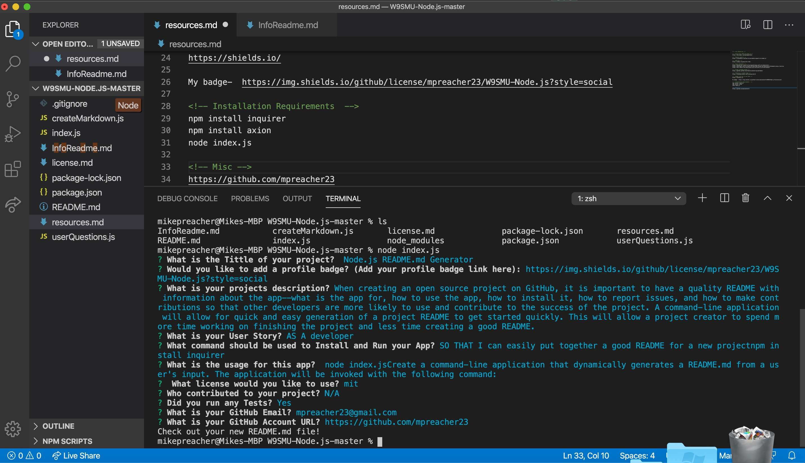

# Unit 09 Node.js and ES6+ Homework: Good README Generator

 ## Badge Image

  
  

## Description

Create a command-line application that dynamically generates a README.md from a user's input. The application will be invoked with the following command:

## Table of Contents 
**[Installation](#Installation)** 
**[Usage](#Usage)** 
**[License](#License)** 
**[Contributors](#Contributors)** 
**[Tests](#Tests)** 
**[Demo](#Demo)** 
**[Contact](#Contact)** 

## **Installation** 
`npm install` 
`npm install axion` 
`npm install inquirer` 

## **Usage** 
To run the app, use app.js using Node.js to create readme.md markdown files.

## **License** 
mit

## **Contributors**
N/A

## **Tests** 
Tests passed
 

## **Demo** 

 

## Demo App

 

## **Contact**
mpreacher23@gmail.com

